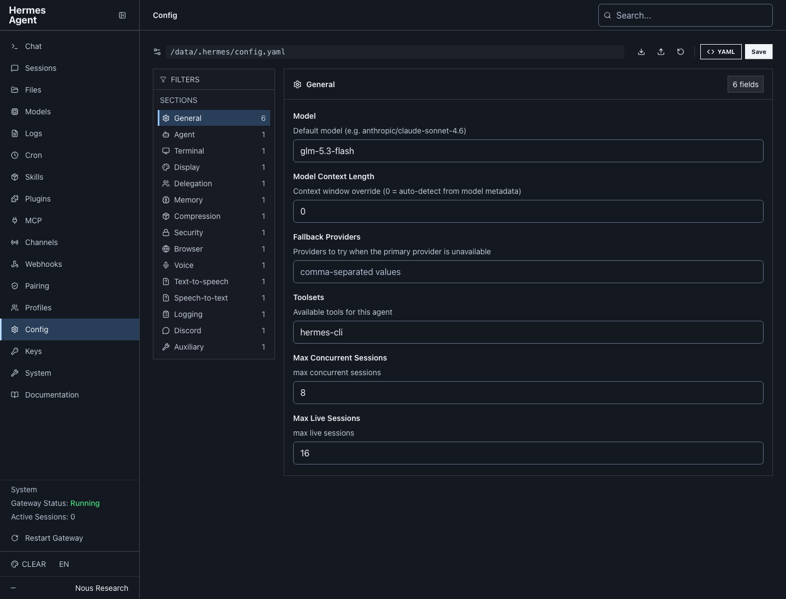

# Clear dashboard skins

Clear replaces the decorative UI fonts with system sans-serif, uses 16px
form text and brighter secondary labels, and adds visible input borders,
colored selection markers, and keyboard focus outlines. Code and terminal
text retain their monospace fonts. It uses Hermes's native custom-theme
support, with no changes to the upstream frontend or reverse proxy.

The Docker image includes two variants: **Clear Owners** (`clear.yaml`,
blue background) and **Clear Team** (`clear-team.yaml`, green background).
On startup, `start.sh` copies missing themes into
`/data/.hermes/dashboard-themes/`. Existing theme files and the selected
theme are preserved.

After deployment, refresh the dashboard and choose the desired Clear variant from the theme
picker at the bottom of the sidebar. Set the picker's font option to
**Theme default** if a previous font override is selected. Choose any other
theme to switch back; Hermes removes Clear's CSS automatically.

For a manual installation, copy `clear.yaml` into the dashboard process's
`HERMES_HOME/dashboard-themes/` directory and refresh the page. This is a
dashboard theme, not a terminal skin (`skins/` is a different directory).

Validated against the pinned Hermes v2026.8.27 theme loader and its actual
React frontend using sample API responses: desktop at 1440px, mobile at
390px, form typography, keyboard focus, and switching themes in both
directions. No production configuration was used for the preview.

